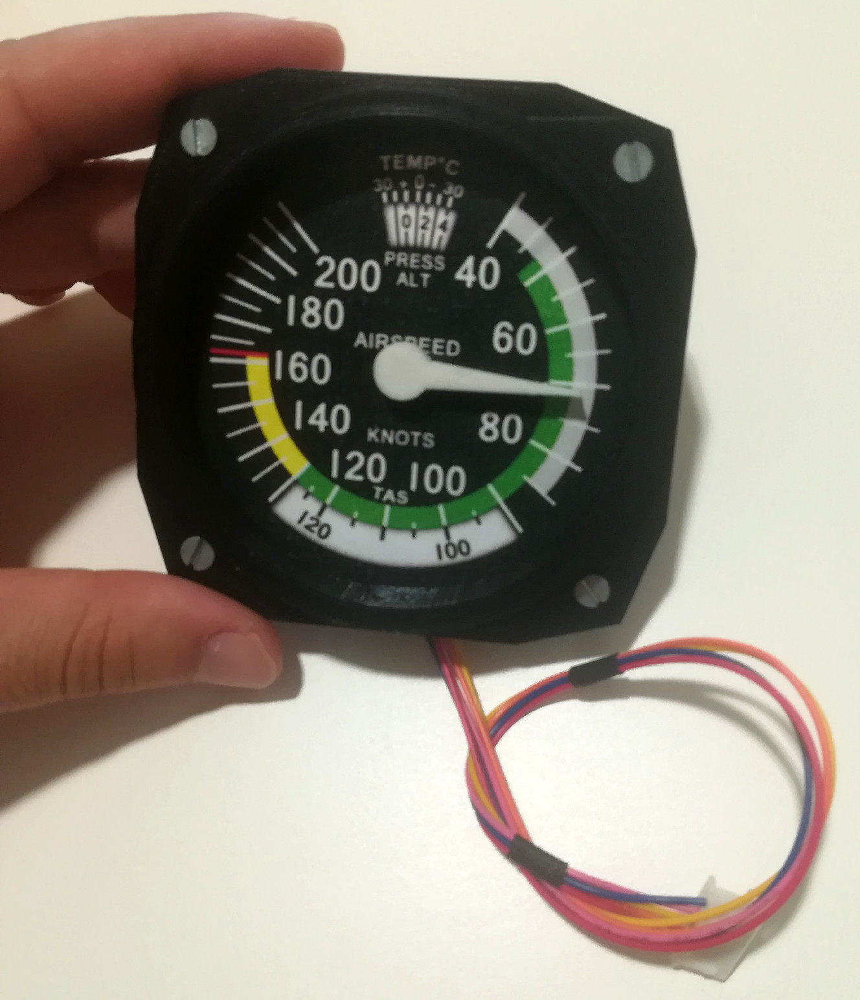

Standard Gauge
==============

This directory holds all necessary files so you can build your own standard 3.5
inches gauge. It is called this way because the diameter of the circumference
which intercepts all four drill holes has this dimension.

Materials and tools required
----------------------------

A list of materials is provided in the lines below:

* x1 3D printer with black colored PLA filament.
* x1 Stepper motor 28byj-48 model.
* x2 M4 Screws 100mm lenght
* x4 M3 Screws 200mm lenght
* x4 M3 Nuts

How to build
------------

1. Print both the `front.stl` and `back.stl` files with the 3D printer.
2. Once completed previous task, glue and paste the printed instrument scale in
   the frontal side of the `back.stl` part. Back part of the instrument is where
   the motor will be placed, as it holds specific supports for this task.
3. Then, simply screw both pieces together, maing sure they are properly
   aligned. Two options are possible: either you let the `front.stl` side
   pointing towards the scale or not. Select the option you like the most.
4. Attach the motor to corresponding frame in back side of `back.stl` piece and
   screw it.

Your instrument is completed. For different instruments with the same
dimensions just background scale has been modified, so building process remains
the same.

Authors
-------

* Alvaro Alea is the original author for the frontal bezel. Check out more of
  his work at
  [official thingiverse profile](https://www.thingiverse.com/alvaroalea/designs).

* Back part was designed by Konstantin Susdaltzdew. More of his work in [this
  website](https://www.thingiverse.com/js4100/designs).
